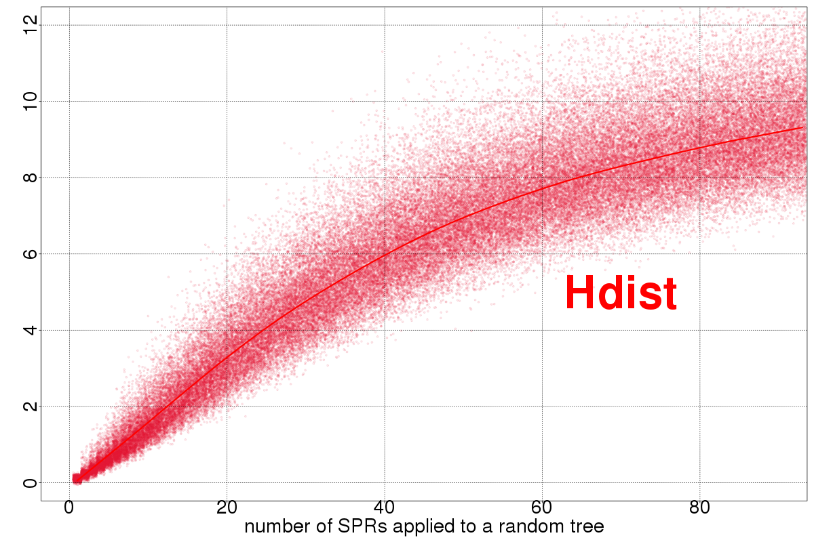
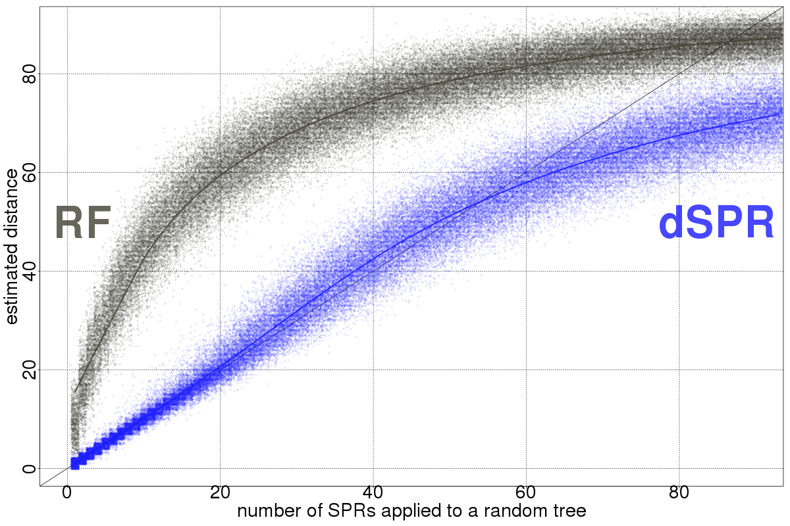

# genefam_dist

A collection of small programs to calculate distances and manipulate mul-trees (gene families) and species trees. These programs use a
development version of the biomcmc library, part of the [guenomu software](https://bitbucket.org/leomrtns/guenomu/) for
phylogenomic species tree inference.

## Installation
These programs use the autotools build system. More details to follow.

```
$ mkdir build
$ cd build
$ ../genefam_dist/configure --prefix /usr/local
$ make; make install
```

## Programs

- ***distmatrix_genetree_sptree*** given two files, one with a list of gene trees and one with a list of species trees,
  calculates a set of distances between all tree pairs

- ***generate_spr_trees*** generates a series of random trees with a given number of SPR operations apart from the next
  one.

## More info
More details to follow, 
- For running the programs, you can have a brief description by running them with no parameters.
- For more details about the calculations and theory, please check the [guenomu software](https://bitbucket.org/leomrtns/guenomu/) and the accompanying publication
  - A Bayesian Supertree Model for Genome-Wide Species Tree Reconstruction, Systematic Biology, 2016 [DOI: 10.1093/sysbio/syu082](http://dx.doi.org/10.1093/sysbio/syu082)
- If you have any question, comment or request please do not hesitate to contact me at leomrtns@gmail.com
- For an (not extensive) introduction on tree distances that I will be focusing on, please have a look at [my recent talk at UNIL](http://www.slideshare.net/leomrtns/comparing-phylogenetic-trees-20160616).

## Performance
The `dSPR` is an approximation to the unrooted SPR which was used on the [recombination detection model](http://www.plosone.org/article/info%3Adoi%2F10.1371%2Fjournal.pone.0002651)
(but faster than the original version and capable of working with arbitrarily large trees). 
The `Hdist` is related to the [clade alignment score](http://bioinformatics.oxfordjournals.org/content/22/1/117), that I rediscovered (with modifications) when speeding up the 
dSPR algortihm.

Notice that the current implementations of these distances are ***not*** designed to work on mul-trees (that is, both
trees must have the same leaves.)




## License 
Copyright (C) 2016-today  [Leonardo de Oliveira Martins](https://github.com/leomrtns)

genefam-dist is free software; you can redistribute it and/or modify it under the terms of the GNU General Public
License as published by the Free Software Foundation; either version 2 of the License, or (at your option) any later
version (http://www.gnu.org/copyleft/gpl.html).

