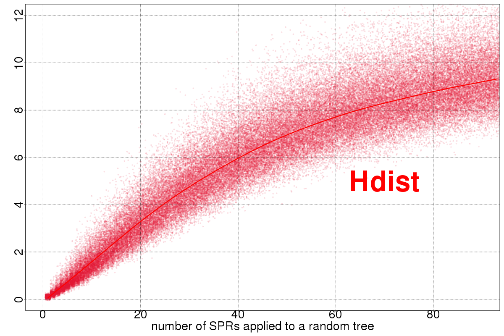
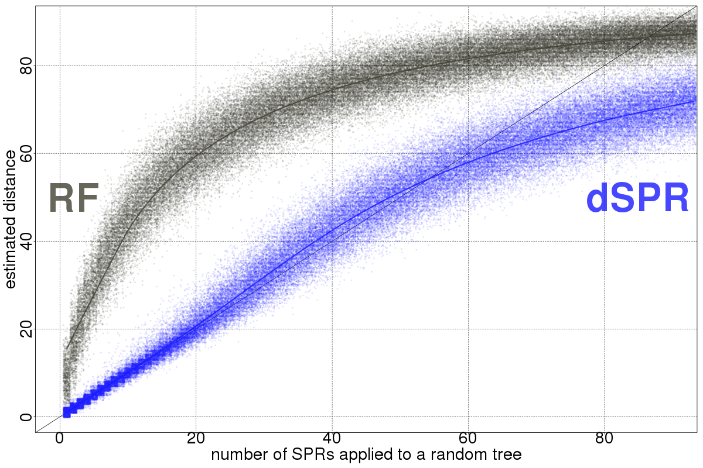

# genefam_dist

The main goal of *genefam_dist* is to describe the "tree signal" of a gene family, which is a vector of 'scores' describing how well
supported this gene family is by a set of reference species trees. You can download [here (PDF)](docs/Evolution2018_LeoMartinsPoster.pdf) 
a low-resolution version of the poster presented at [Evolution 2018](https://www.evolutionmontpellier2018.org/).

The software is composed of a low-level C library to handle mul-trees, a Python module, and standalone programs using the library.
The Python module is called `treesignal` and is the standard way of creating tree signatures. It uses
[DendroPy](https://www.dendropy.org/) for tree manipulation and NumPy for its result arrays. The standalone programs are described below.

The library is written in C, with functions to calculate distances between mul-trees (gene families) and species trees. 
It uses a modified internal biomcmc library, part of the [guenomu software](https://bitbucket.org/leomrtns/guenomu/). 

## Installation

### Python package

The Python package uses the native [CPython C API](https://docs.python.org/3/c-api/) directly. Its build compiles the
`genefam_dist` C sources into `treesignal._treesignalc`, so no separate library installation, hard-coded paths, or 
runtime linker configuration is needed. 
A C compiler and Python development headers are required. 

Install the dependency-free native API from the repository root:

```console
python -m pip install .
```

The reusable native API does not require DendroPy or NumPy:

```python
from treesignal import TreeSpace, from_tree_spaces

gene = TreeSpace("(((A,B),(C,D)),((E,F),(G,H)));")
species = TreeSpace(
    "(((A,B),(C,D)),((E,F),(G,H)));"
    "(((A,C),(B,D)),((E,G),(F,H)));",
    rooted=True,
)
distances = from_tree_spaces(gene, species)
```

`TreeSpace` owns the parsed C `topology_space` and can be reused across calls.
The original string-based functions remain available in `treesignal._treesignalc`
for compatibility, but parse their Newick arguments on every call. Install the
DendroPy/NumPy-based `TreeSignal` API with:

```console
python -m pip install '.[legacy]'
```

For development, use an editable installation and run the tests:

```console
python -m pip install --editable '.[test]'
python -m pytest
```

To use conda, the included environment file creates an isolated environment and installs the extension in editable mode:

```console
conda env create --file environment.yml
conda activate treesignal
python -m pytest
```

You can then use the package with `import treesignal`. The extension source is in `python/treesignal/_treesignalc.c`; new low-level wrappers can be added
there and the corresponding C implementation can be added under `lib/`.

## Downloading gene families from OMA

[`scripts/download_oma_hogs.py`](scripts/download_oma_hogs.py) downloads the
extant protein, coding-DNA, and AlphaFold 3Di sequences descended from genes
inferred in an OMA
ancestral genome. It uses only the Python standard library and caches API
responses so an interrupted run can be resumed.

There are two useful ways to define an output family:

- `--grouping ancestral-gene` (the default) writes one FASTA for each HOG at
  the selected ancestral level. If a root family had already duplicated before
  that ancestor, its copies are independent output families.
- `--grouping root-hog` merges all ancestral copies that share a root HOG.
  The accompanying member table retains the level-specific `ancestor_hog_id`,
  so the merged family can be split again without another OMA query.

Start with a small Enterobacterales run:

```console
python scripts/download_oma_hogs.py \
  --level o__Enterobacterales \
  --output-dir data/oma-enterobacterales \
  --grouping ancestral-gene \
  --max-families 10
```

To download every family passing the default filters (completeness at least
0.2 and at least four member genes in four species), explicitly use `--all`.
In root-HOG mode, a root family is selected if at least one ancestral-gene
component passes the completeness threshold, then all components of that root
family are retained:

```console
python scripts/download_oma_hogs.py \
  --level o__Enterobacterales \
  --output-dir data/oma-enterobacterales-root-hogs \
  --grouping root-hog \
  --all
```

The result contains:

- `families/*.faa`, `*.fna`, and `*.3di.fasta`: protein, coding-DNA, and 3Di
  FASTA files (use `--sequence-type` to request only one type);
- `members/*.members.tsv`: OMA protein, species, ancestral-HOG, and root-HOG
  metadata for every sequence;
- `families.tsv`: a family-level manifest;
- `run.json`: the level, grouping, filters, and API endpoint used;
- `.cache/`: cached OMA JSON responses used to resume or repeat a run. The
  cache is deliberately retained; it can be deleted after a successful run if
  disk space is more important than a fast restart.

Completed family files and `families.tsv` are written atomically and act as
checkpoints. Re-running the same command skips complete families and reuses
the cached JSON unless `--force` or `--refresh-cache` is supplied.

To download the exact AlphaFold models matching those OMA sequences and build
structure-based amino-acid alignments with FoldMason:

```console
python scripts/align_oma_hogs.py \
  --input-dir data/oma-enterobacterales
```

The script resolves each OMA member through `members/*.members.tsv` when
available, queries the AlphaFold DB API using a UniProt accession, and accepts
a model only when its amino-acid sequence exactly matches OMA. Cached OMA
protein JSON supplies IDs when a member table is absent or incomplete. This
works only for proteins that OMA identifies with a UniProt accession. In
particular, RefSeq/GenBank-only OMA proteins (such as `WP_...`) cannot be
looked up in AlphaFold DB: their OMA 3Di strings are ProstT5 predictions, not
downloadable AlphaFold coordinates. Provide predicted or experimental
PDB/mmCIF structures for every member before using FoldMason in that case.
Results are written below
`structure-alignments/`:

- `structures/<family>/*.cif`: downloaded AlphaFold models;
- `alignments/<family>_aa.fa`: FoldMason amino-acid alignment;
- `alignments/<family>_3di.fa`: matching FoldMason 3Di alignment;
- `structure-alignments.tsv`: restartable family-level manifest;
- `.cache/afdb/`: reusable AlphaFold metadata.

Use `--download-only` to fetch and validate coordinates without running
FoldMason. Existing models and completed alignments are reused by default;
`--refresh` replaces them.

OMA levels are data-release-specific. The same command works for fungi or any
other ancestral genome after replacing `--level` with the exact level shown by
the [OMA ancestral-genome browser](https://omabrowser.org/oma/genome/). Use a
small `--max-families` run first to validate the name and sampling. The OMA API
defines HOGs at a taxonomic level and exposes their member proteins in its
[REST documentation](https://omabrowser.org/api/docs).

### C library and standalone programs

The standalone programs use the Autotools build system. A clean out-of-tree build can be installed with:

```console
mkdir build
cd build
../configure --prefix="$HOME/.local"
make
make install
```

This standalone installation is independent of the Python package. See the notebooks in the [docs directory](docs) for examples.


## Programs
Here is a list of standalone programs that will be compiled and installed with autotools. Run them without arguments for a brief explanation
(they are simple but require a rigid structure for the arguments).

- ***gf_distmatrix_genetree_sptree*** given two files, one with a list of gene trees and one with a list of species trees,
  calculates a set of distances between all tree pairs

- ***gf_distsignal_genetree_sptree*** given two files, like the distmatrix program above, but all distances for one gene
  tree per line, as in the tree signature vector

- ***gf_generate_spr_trees*** generates a series of random trees with a given number of SPR operations apart from the next
  one.

- ***gf_spr_distance*** calculates the approximate unrooted SPR distance between consecutive pairs of trees in a nexus file
  (this program assumes single-labelled trees, that is, no paralogs etc. are allowed)

- ***gf_concatenate_trees*** takes two nexus trees (from e.g. [MrBayes](http://nbisweden.github.io/MrBayes) analyses) and merge them by
  excluding first trees and thinning, if needed. It also excludes less frequent trees and assumes unrooted topologies (i.e. it neglects root
  information), important since returns a *trprobs* nexus file. 

- ***gf_find_best_trees*** takes a (large) number of gene families and estimates patristic distance-based species trees, as well as tries to
  find species trees minimising all/some distances. This is an experimental program, intended as a replacement for the `bmc2_maxtree` program from 
  [guenomu](https://bitbucket.org/leomrtns/guenomu/).


## More info
More details to follow, 
- For running the programs, you can have a brief description by running them with no parameters.
- For more details about the calculations and theory, please check the [guenomu software](https://bitbucket.org/leomrtns/guenomu/) and the accompanying publication
  - A Bayesian Supertree Model for Genome-Wide Species Tree Reconstruction, Systematic Biology, 2016 [DOI: 10.1093/sysbio/syu082](http://dx.doi.org/10.1093/sysbio/syu082)
- If you have any question, comment or request please do not hesitate to contact me at leomrtns@gmail.com
- For an (not extensive) introduction on tree distances that I will be focusing on, please have a look at [this talk at UNIL](http://www.slideshare.net/leomrtns/comparing-phylogenetic-trees-20160616).

## Performance of the SPR approximation
The `dSPR` is an approximation to the unrooted SPR which was used on the [recombination detection model](http://www.plosone.org/article/info%3Adoi%2F10.1371%2Fjournal.pone.0002651)
(but faster than the original version and capable of working with arbitrarily large trees). 
The `Hdist` is related to the [clade alignment score](http://bioinformatics.oxfordjournals.org/content/22/1/117), that I rediscovered (with modifications) when speeding up the 
dSPR algortihm.

Notice that our current implementations of these distances can work on mul-trees on a very experimental setting (using the *extended species tree* concept from the 
[mulRF algorithm](https://www.ncbi.nlm.nih.gov/pubmed/25273112)), but the results below assume the same leaf set between trees. 




## License 
Copyright (C) 2016-today  [Leonardo de Oliveira Martins](https://github.com/leomrtns)

genefam-dist is free software; you can redistribute it and/or modify it under the terms of the GNU General Public
License as published by the Free Software Foundation; either version 2 of the License, or (at your option) any later
version (http://www.gnu.org/copyleft/gpl.html).
